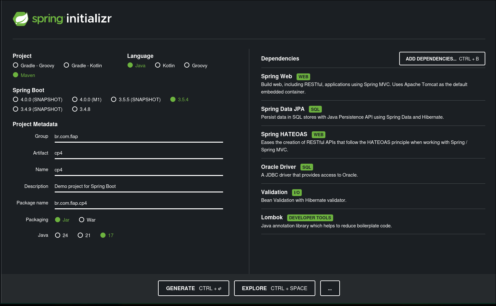

# Mercadinho Show da Bola

API feita em Java para informar os produtos que nosso mercadinho possui;

## Integrantes

| Nome |  RM  |
| :--- | :--: | 
| Otavio Miklos | 554513 |
| Luciayla Yumi | 557987 |
| Tiago Ribeiro | 558021 |
| Raphaela Tatto | 554983 |

---

## Sumário
- [Definição do projeto](#definição)
    - [Link do deploy](#link-do-deploy)
    - [Tecnologias](#tecnologias)
    - [Spring Initialzr](#spring-initializr)
- [Subindo a API](#rodando-a-api)
- [Rotas](#rotas)

---

## Definição

Projeto feito seguindo as boas práticas e requisições feitas, usando **Lombok**, porta da aplicação **8082**, delete pelo **id**, **HATEOAS** configurado, **deploy** feito;

### Link do deploy
[]()

### Tecnologias
- Java 17+
- Spring Boot
- Maven
- Banco de Dados: Oracle
- Lombok, Spring Web, Spring Data JPA, Spring HATEOAS, Oracle Driver, Validation

### Spring Initializr


---

## Rodando a API
```bash
# Clone o repositório
git clone https://github.com/omininola/cp4_java

# Entre no diretório
cd cp4_java

# Rode com o Maven
./mvnw spring-boot:run
```

---

## Rotas

[POST /mercado]()
- Descrição: Cria um novo produto no mercadinho
- Status: 200
- Body:
```json
{
    "nome": "Cubo Mágico",
    "tipo": "Puzzle",
    "setor": "Brinquedo",
    "tamanho": "10cm x 10cm",
    "preco": 600
}
```

[GET /mercado]()
- Descrição: Retorna todos os produtos do mercadinhos
- Status: 200

[GET /mercado/{id}]()
- Descrição: Retorna o produto referente ao ID passado na URL
- Status: 200, 404

[PUT /mercado/{id}]()
- Descrição: Atualiza o produto referente ao ID passado na URL
- Status: 200, 404
- Body:
```json
{
    "nome": "Cubo Mágico",
    "tipo": "Puzzle",
    "setor": "Brinquedo",
    "tamanho": "10cm x 10cm",
    "preco": 600
}
```

[DELETE /mercado/{id}]()
- Descrição: Deleta o produto referente ao ID passado na URL
- Status: 201, 404